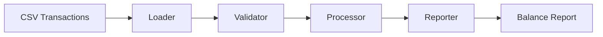

# Lexian Transaction Engine


**Production-minded batch transaction processing for a fictional fintech engineering portfolio.**

Lexian Transaction Engine is the first public product in the Lexian Engineering Portfolio. V1 focuses on a small but complete batch workflow: ingest synthetic transactions, validate business rules, calculate balances, generate reports, and keep the project testable, documented, and CI-ready.

Lexian is fictional and uses synthetic data only. This repository does not contain real customer data, employer data, Klar internal data, or confidential information.

## Current Status

| Version | Status | Scope |
| --- | --- | --- |
| V1 | Active | Batch Transaction Processing |
| V2 | Active | Operational Observability |
| V3 | In Progress | Local Analytical Warehouse |

V1 is intentionally scoped. Later versions will expand operational visibility, persistence, reconciliation, orchestration, graph auditability, and cloud deployment as the business scenario grows.

## Architecture



## What The Pipeline Does

- Loads transactions from `data/raw/transactions.csv`.
- Validates required columns and duplicate transaction IDs.
- Rejects unsupported transaction types.
- Rejects non-numeric, zero, or negative amounts.
- Processes deposits and withdrawals into user balances.
- Writes a balance report to `data/reports/balances.csv`.

## What This Demonstrates

- Python package structure with a `src/` layout.
- Data validation and explicit business rules.
- Batch data processing with pandas.
- Unit and integration testing with pytest.
- Linting with ruff.
- CI with GitHub Actions.
- Technical documentation with ADRs and RFCs.
- Early observability foundations through RFC 0002 and in-progress execution tracking.

## Run Locally

```bash
make install
make run
make test
make lint
```

The package command is:

```bash
python -m lexian_transaction_engine.main
```

## Repository Structure

```text
.
├── data/
├── docs/
├── src/lexian_transaction_engine/
├── tests/
├── Makefile
├── pyproject.toml
└── README.md
```

## Roadmap

| Version | Portfolio Month | Focus |
| --- | --- | --- |
| V1 | Month 1 | Batch Transaction Engine |
| V2 | Month 2 | Operational Observability |
| V3 | Month 3 | SQL + Warehouse Foundations / Local Analytical Warehouse |
| V4 | Month 4 | Analytics Engineering Layer |
| V5 | Month 5 | AWS Data Pipeline Prototype |
| V6 | Month 6 | Reconciliation + Graph Auditability |

The broader 12-month path lives in the [Portfolio Hub](https://github.com/arza1uz/Portfolio).

## Local Analytical Warehouse

V3 introduces a local analytical warehouse using DuckDB. The goal is to make transaction outputs, balances, and pipeline execution metadata queryable with SQL before introducing cloud infrastructure or dbt.

The first warehouse layer includes:

- raw transaction rows for auditability,
- validated transaction facts,
- user balance facts,
- pipeline execution metadata,
- reusable SQL queries for operational analysis.

## Documentation

- [Business Context](docs/business-context.md)
- [Architecture](docs/architecture.md)
- [Roadmap](docs/roadmap.md)
- [Local Analytical Warehouse](warehouse/README.md)
- [ADRs](docs/adr/README.md)
- [RFCs](docs/rfc/README.md)

## Portfolio Context

This repository is not a tutorial clone and not a giant monorepo. It is a focused product repository designed to demonstrate data engineering, analytics engineering, fintech data systems, documentation, testing, and operational thinking.
