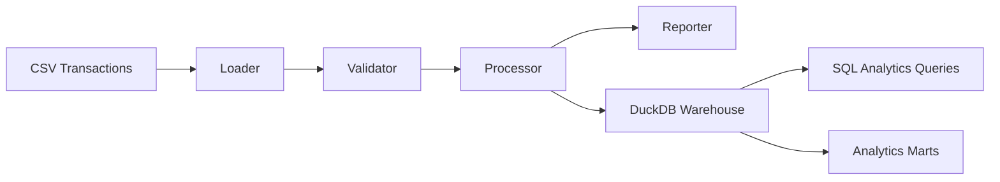

# Lexian Transaction Engine


**Production-minded batch transaction processing and local analytics for a fictional fintech data system.**

Lexian Transaction Engine processes synthetic fintech transactions, validates business rules, calculates balances, captures operational execution context, and exposes local analytical warehouse outputs through DuckDB and SQL queries. Current released work includes batch processing, operational observability, local warehouse foundations, and warehouse analytics queries.

Lexian is fictional and uses synthetic data only. This repository does not contain real customer data, employer data, Klar internal data, or confidential information.

## Current Capabilities

**Transaction Processing**

- Synthetic CSV transaction ingestion
- Transaction validation
- Deposit and withdrawal processing
- Balance calculation

**Operational Observability**

- Operational execution tracking
- Structured logging

**Local Analytical Warehouse**

- DuckDB local warehouse
- Raw and fact tables
- Execution metadata

**Warehouse Analytics**

- SQL analytics queries
- Data quality and validation queries
- Balance validation
- Transaction volume
- Pipeline health
- Anomaly checks

**Analytics Engineering Layer**

- Reusable analytical marts
- Metric definitions
- Model definitions
- Validation models
- SQL-based business outputs

## Architecture



## Run Locally

```bash
make install
make run
make test
make lint
```

The package command is:

```bash
python -m lexian_transaction_engine.main
```

## Repository Structure

```text
.
├── analytics/
├── data/
├── docs/
├── scripts/
├── src/lexian_transaction_engine/
├── tests/
├── warehouse/
├── Makefile
├── pyproject.toml
└── README.md
```

## Documentation

- [Business Context](docs/business-context.md)
- [Architecture](docs/architecture.md)
- [Development Focus](docs/development-focus.md)
- [Local Analytical Warehouse](warehouse/README.md)
- [Analytics Engineering Layer](analytics/README.md)
- [RFC 0004: Analytics Engineering Layer](docs/rfc/0004-analytics-engineering-layer.md)
- [ADRs](docs/adr/README.md)
- [RFCs](docs/rfc/README.md)

## Current Development Focus

Current development is focused on the Analytics Engineering Layer and Validation Layer.

Future work will extend the system into reconciliation, break management, graph auditability, cloud data workflows, ML/Risk, and AI-assisted investigation.

## Portfolio Context

This repository is not a tutorial clone and not a giant monorepo. It is a focused technical project designed to demonstrate data engineering, analytics engineering, fintech data systems, documentation, testing, and operational thinking.
