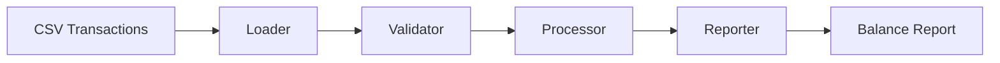

# Lexian Transaction Engine


Lexian Transaction Engine is the first product repository in a fictional fintech engineering portfolio. It implements a small, production-minded batch transaction pipeline that loads synthetic CSV transactions, validates them, processes deposits and withdrawals, and generates user balance reports.

Lexian is a fictional fintech created for a professional engineering portfolio. This repository uses synthetic data only and does not contain real customer, employer, or production information.

## Business Problem

Lexian serves people who are underserved or rejected by traditional banking institutions. Even at an early stage, the company needs trustworthy transaction processing: deposits and withdrawals must be validated, balances must be explainable, and bad input data must be rejected before it affects reporting or downstream decisions.

## Role In The Lexian Ecosystem

This repository represents the first standalone product service in the future Lexian ecosystem. It focuses only on transaction processing. Future systems such as reconciliation, risk, fraud, data platform, ML platform, and AI platform are intentionally referenced in documentation, not implemented here.

## Architecture



## Current Capabilities

- Loads transactions from `data/raw/transactions.csv`.
- Validates required columns.
- Rejects duplicate transaction IDs.
- Rejects non-numeric, zero, or negative amounts.
- Rejects unsupported transaction types.
- Processes deposits and withdrawals into user balances.
- Writes a simple balance report to `data/reports/balances.csv`.
- Runs from the command line with `python -m lexian_transaction_engine.main`.

## Skills Demonstrated

- Python package structure with a `src/` layout.
- Data validation and explicit business rules.
- Batch data processing with pandas.
- Unit and integration testing with pytest.
- Lightweight CI, linting, and repository hygiene.
- Product documentation, ADRs, RFCs, and portfolio storytelling.

## Repository Structure

```text
.
├── configs/
├── data/
├── docs/
├── scripts/
├── src/lexian_transaction_engine/
├── tests/
├── Makefile
├── pyproject.toml
└── README.md
```

## Run Locally

```bash
python -m pip install -e ".[dev]"
make run
```

You can also run the package command directly after installation:

```bash
python -m lexian_transaction_engine.main
```

## Run Tests

```bash
make test
make lint
```

## Roadmap And Learning Unlocks

The current version is intentionally simple: CSV batch processing first, then validation, reporting, reconciliation, analytical storage, orchestration, streaming, cloud infrastructure, ML, and AI capabilities as business needs appear. See `docs/roadmap.md` and `docs/learning-unlocks.md`.

## Future Lexian Products

This repository will connect conceptually to future standalone repositories:

- `lexian-reconciliation-engine`
- `lexian-risk-engine`
- `lexian-fraud-engine`
- `lexian-data-platform`
- `lexian-ml-platform`
- `lexian-ai-platform`

Each future product should remain understandable on its own while contributing to the larger Lexian engineering story.

## Status

V1 batch transaction processing is implemented for synthetic data. The repository is ready for incremental expansion without becoming a giant monorepo.
