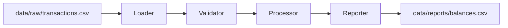

# Architecture

Lexian Transaction Engine V1 is a batch-oriented CSV pipeline. It is intentionally scoped so the business rules are easy to inspect, test, and evolve.

## Modules

- `loader.py` reads transaction CSV files into memory.
- `validator.py` enforces required schema, unique transaction IDs, supported transaction types, and positive numeric amounts.
- `processor.py` calculates ending balances by applying deposits and withdrawals.
- `reporter.py` prepares and writes the balance report.
- `main.py` coordinates the end-to-end pipeline.

## Design Decisions

- Batch CSV comes first because it is a realistic MVP integration pattern for early operational reporting, manual exports, and partner handoffs.
- Simple Python modules come first because the current product needs clear business logic more than distributed infrastructure.
- Kafka, Spark, Airflow, and cloud services are deferred until volume, latency, scheduling, or operational complexity justifies them.

## Data Contract

Input transactions require these columns:

- `transaction_id`
- `user_id`
- `timestamp`
- `type`
- `amount`

Supported transaction types are `deposit` and `withdrawal`. Amounts must be numeric and greater than zero.

## Evolution Triggers

The architecture should evolve when Lexian needs persistent storage, reconciliation against external partners, scheduled workflows, near-real-time updates, graph-based auditability, or cloud operational controls.
