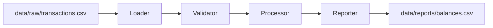

# Architecture

Lexian Transaction Engine v1 is a batch-oriented CSV pipeline. It is intentionally small so the business rules are easy to inspect, test, and evolve.

## Modules

- `loader.py` reads transaction CSV files into memory.
- `validator.py` enforces required schema, unique transaction IDs, supported transaction types, and positive numeric amounts.
- `processor.py` calculates ending balances by applying deposits and withdrawals.
- `reporter.py` prepares and writes the balance report.
- `main.py` coordinates the end-to-end pipeline.

## Data Contract

Input transactions require these columns:

- `transaction_id`
- `user_id`
- `timestamp`
- `type`
- `amount`

Supported transaction types are `deposit` and `withdrawal`. Amounts must be numeric and greater than zero.
